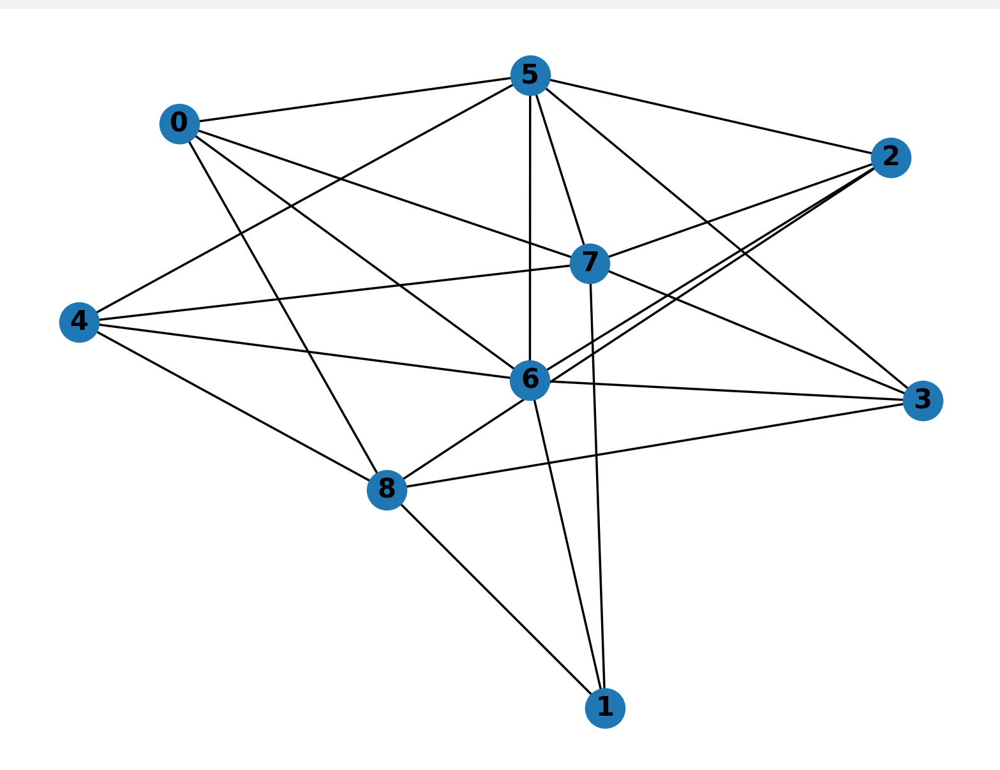
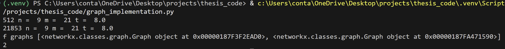

# Masters_Thesis_Code
## Objective

- The topic of this thesis was to attempt to prove or find a counter example for Conjecture
1.10 from a 2019 paper by McCarty and Thomas. The conjecture states that every
linklessly embeddable graph on n ≥ 7 vertices has at most 3n − 9 + t/3 edges.
Here n denotes the number of vertices of the graph, and t is the number of triangles.

## Definitions

-  A graph is an ordered pair G = (V (G), E(G)), where V (G) is the set of vertices of G, and E(G) is the set of edges between vertices.

-  A cycle of length three is called a triangle.

-  A spatial graph is an embedding of a graph G in R3 or S3. The vertices of such a graph are points and the edges are curves connecting the points. The edges have pairwise disjoint interiors.

-   A link with n components is the image of n disjoint copies of S1 into R3.

-   A link L is split if there is an embedding of a 2-sphere F in R3 \ L such that each component of R3 \ F contains at least one component of L. 

-  A graph is planar if it can be drawn in the plane without edge intersections.

- A graph is non-intrinsically linked, or linklessly embeddable if it has a spatial embedding which contains no non-trivial links. Otherwise the graph is intrinsically linked (IL).

- A graph G is said to be n-apex if there exist vertices v1, ..., vn in G such that G − {v1, ..., vn} is planar.

## Motivation

- This code is specifically used to find all 2-apex graphs of order up to nine, for which
the inequality fails. It remains to checked if these graphs are linklessly embeddable.

## Structure
- This file contains several .g6 files which store graph information, and graph_implementation.py which contains the main code.
- The function create_2_apex() takes in a list of graphs stored in a .g6 file and adds edges u and v making them 2-apex. It returns the new list of graphs with their number of triangles and edges
- check_conjecture() takes in a graph and checks to see if the conjecture holds. If it is satisfied it returns a zero, if the inequality does not hold it returns a 1.
- delete_edge_check_u() deletes edges from vertex u, checks the conjecture, and appends graphs which fail to satisfy the conjecture to the list bad_graphs. returns bad_graphs.
- delete_edge_check_v() deletes edges from vertex v, checks the conjecture, and appends graphs which fail to satisfy the conjecture to the list bad_graphs. returns bad_graphs.

## Example
- Show screen shots of code running explain example case for using code show results
- 
- 
- 
- 
